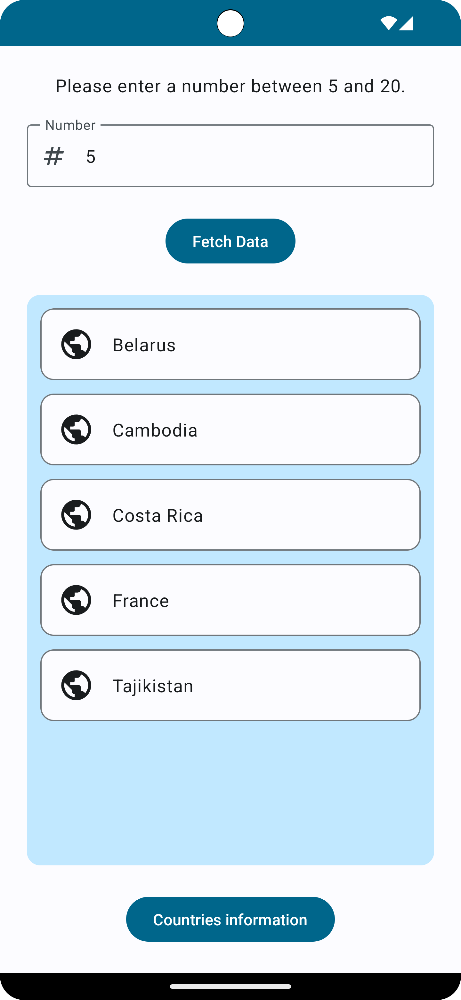
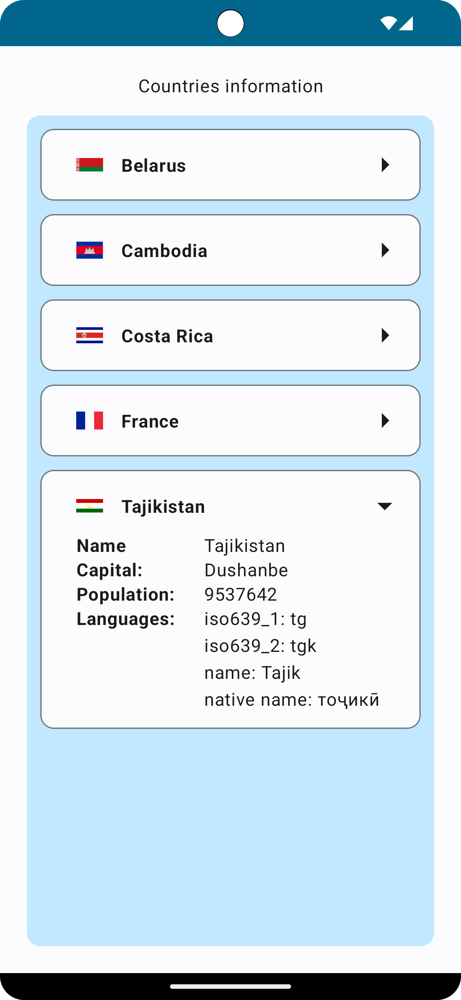

# RandomCountry

RandomCountry is an Android application developed using Jetpack Compose, a modern UI toolkit for building native Android apps. It provides users with an engaging experience for discovering information about random countries. The app comprises two main screens, each serving a distinct purpose:

## RandomCountries

This screen leverages the [Random Data API](https://random-data-api.com/) to retrieve random address information for countries. Users have the option to input a number between 5 and 20, upon which they will be presented with a selection of random countries.

  

## RandomCountriesInfo

The RandomCountriesInfo screen harnesses the power of the [Rest Countries API](https://restcountries.com/) to deliver comprehensive information about countries. In addition to textual data, this screen integrates [Coil](https://github.com/coil-kt/coil), a robust image loading library, to seamlessly display the flags of the respective countries. This enhancement contributes to an enriched visual experience for users.

  

## Technologies Used

- **Jetpack Compose**: This modern UI toolkit is the cornerstone for constructing the native Android user interface, ensuring a contemporary and user-friendly design.

- **RESTful API**: Utilized for seamless data retrieval from external sources.

- **Retrofit**: A powerful HTTP client for Android that simplifies the process of sending requests to a RESTful API.

- **Coil**: Serving as a powerful image loading library, Coil is instrumental in the seamless display of country flags. This feature significantly enhances the visual appeal of the app.

## Installation

To set up and run RandomCountry on your local environment, follow these steps:

1. Clone the repository to your local machine.
2. Open the project in Android Studio.
3. Proceed to build and run the project on either an Android device or an emulator.

## Usage

Once RandomCountry is installed and launched on your device, follow these steps:

1. Enter a number between 5 and 20 to initiate the application.
2. Explore the RandomCountries screen to discover information about random countries.
3. Navigate to the RandomCountriesInfo screen for in-depth and comprehensive details about each country.
4. Enjoy an immersive experience with flags seamlessly loaded using Coil, enhancing the visual appeal of the app.

## License

This project is licensed under the [Apache License 2.0](./LICENSE).
